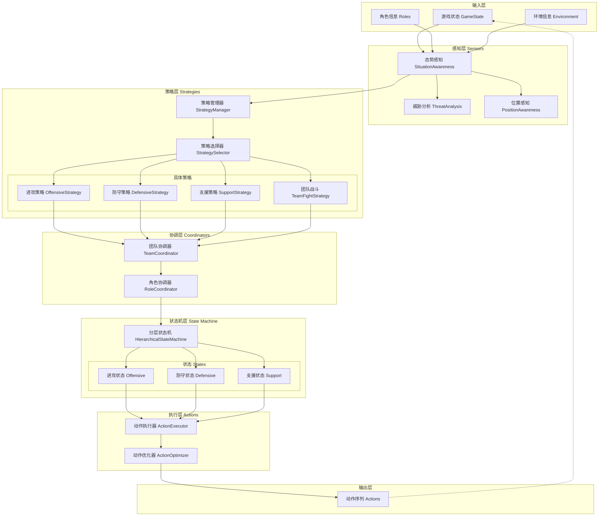
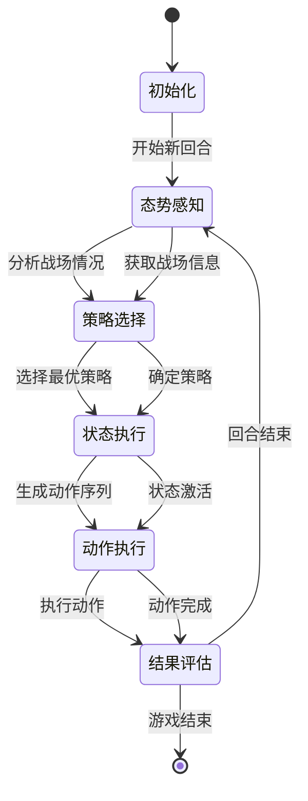
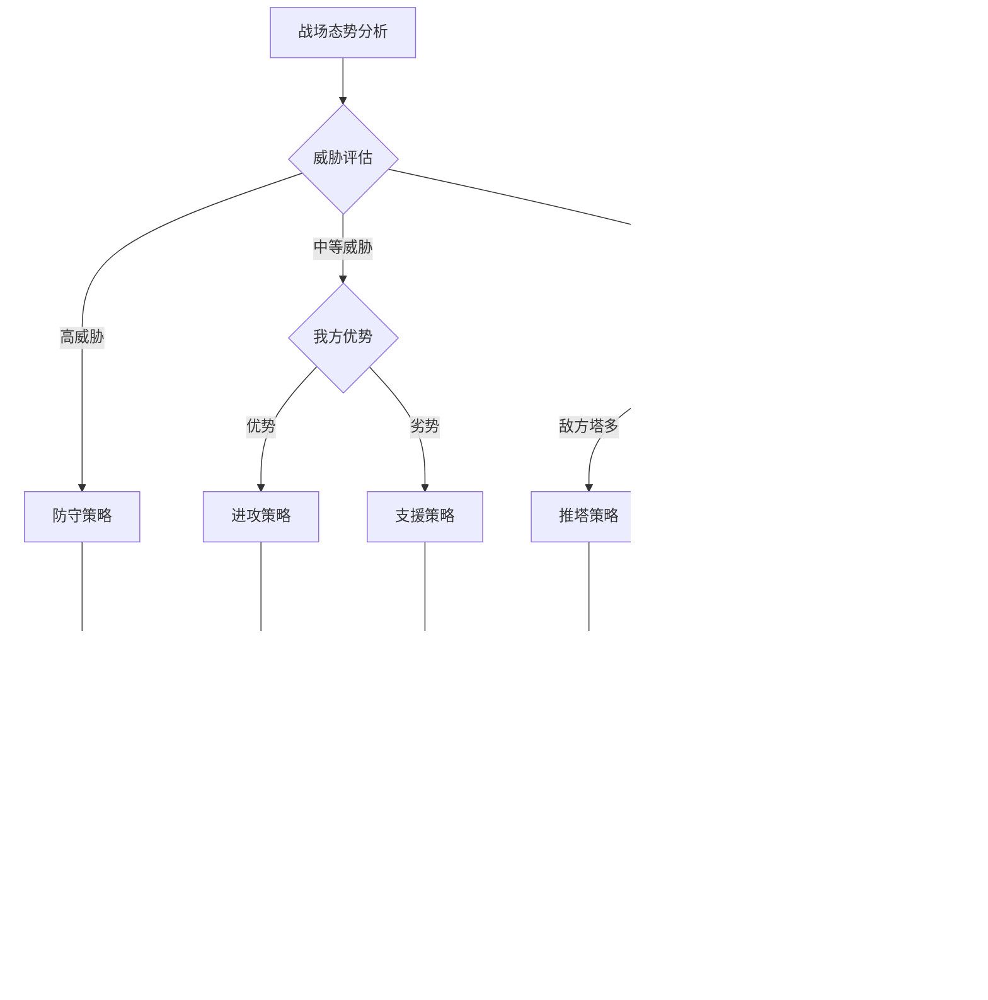
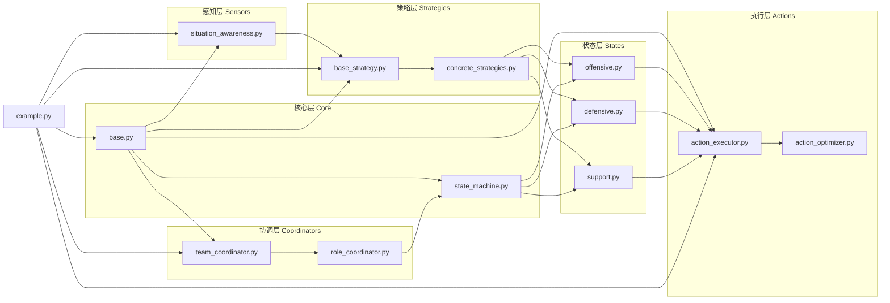
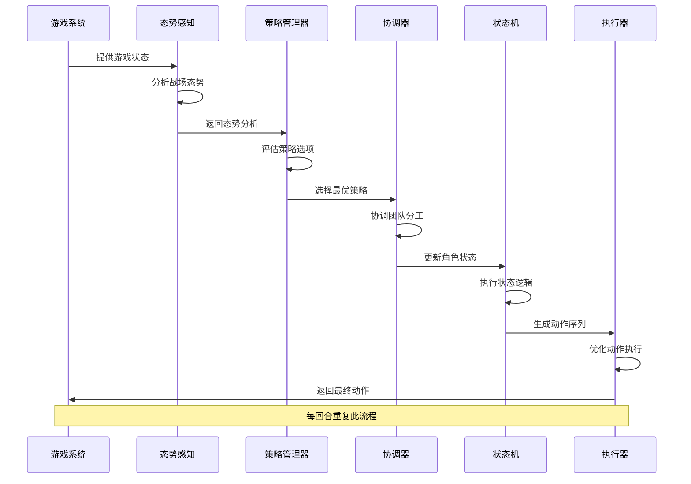

# 系统架构图

## 1. 整体架构图

```mermaid
graph TB
    subgraph "输入层"
        GS[游戏状态 GameState]
        RI[角色信息 Roles]
        EM[环境信息 Environment]
    end

    subgraph "感知层 Sensors"
        SA[态势感知 SituationAwareness]
        TA[威胁分析 ThreatAnalysis]
        PA[位置感知 PositionAwareness]
    end

    subgraph "策略层 Strategies"
        SM[策略管理器 StrategyManager]
        SS[策略选择器 StrategySelector]

        subgraph "具体策略"
            OS[进攻策略 OffensiveStrategy]
            DS[防守策略 DefensiveStrategy]
            SS2[支援策略 SupportStrategy]
            TS[团队战斗 TeamFightStrategy]
        end
    end

    subgraph "协调层 Coordinators"
        TC[团队协调器 TeamCoordinator]
        RC[角色协调器 RoleCoordinator]
    end

    subgraph "状态机层 State Machine"
        HSM[分层状态机 HierarchicalStateMachine]

        subgraph "状态 States"
            OFF[进攻状态 Offensive]
            DEF[防守状态 Defensive]
            SUP[支援状态 Support]
        end
    end

    subgraph "执行层 Actions"
        AE[动作执行器 ActionExecutor]
        AO[动作优化器 ActionOptimizer]
    end

    subgraph "输出层"
        Actions[动作序列 Actions]
    end

    %% 数据流
    GS --> SA
    RI --> SA
    EM --> SA

    SA --> SM
    SA --> TA
    SA --> PA

    SM --> SS
    SS --> OS
    SS --> DS
    SS --> SS2
    SS --> TS

    OS --> TC
    DS --> TC
    SS2 --> TC
    TS --> TC

    TC --> RC
    RC --> HSM

    HSM --> OFF
    HSM --> DEF
    HSM --> SUP

    OFF --> AE
    DEF --> AE
    SUP --> AE

    AE --> AO
    AO --> Actions

    %% 反馈循环
    Actions -.-> GS
```

## 2. 分层状态机流程图

```mermaid
stateDiagram-v2
    [*] --> 初始化

    初始化 --> 态势感知: 开始新回合
    态势感知 --> 策略选择: 分析战场情况
    策略选择 --> 状态执行: 选择最优策略
    状态执行 --> 动作执行: 生成动作序列
    动作执行 --> 结果评估: 执行动作
    结果评估 --> 态势感知: 回合结束
    结果评估 --> [*]: 游戏结束

    %% 状态转换条件
    态势感知 --> 策略选择: 获取战场信息
    策略选择 --> 状态执行: 确定策略
    状态执行 --> 动作执行: 状态激活
    动作执行 --> 结果评估: 动作完成
```

## 3. 策略切换决策图

```mermaid
graph TD
    A[战场态势分析] --> B{威胁评估}

    B -->|高威胁| C[防守策略]
    B -->|中等威胁| D{我方优势}
    B -->|低威胁| E{敌方塔数}

    C --> F[撤退/防守姿态]
    D -->|优势| G[进攻策略]
    D -->|劣势| H[支援策略]

    E -->|敌方塔多| I[推塔策略]
    E -->|敌方塔少| J{团队规模}

    G --> K[主动进攻]
    H --> L[治疗/保护]
    I --> M[集中推塔]

    J -->|大规模| N[团队战斗]
    J -->|小规模| O[游击战术]

    F --> P[生成防守动作]
    K --> P
    L --> P
    M --> P
    N --> P
    O --> P

    P --> Q[动作优化]
    Q --> R[执行动作]
```

## 4. 模块依赖关系图

```mermaid
graph LR
    subgraph "核心层 Core"
        base[base.py]
        sm[state_machine.py]
    end

    subgraph "感知层 Sensors"
        sa[situation_awareness.py]
    end

    subgraph "策略层 Strategies"
        bs[base_strategy.py]
        cs[concrete_strategies.py]
    end

    subgraph "状态层 States"
        off[offensive.py]
        def[defensive.py]
        sup[support.py]
    end

    subgraph "协调层 Coordinators"
        tc[team_coordinator.py]
        rc[role_coordinator.py]
    end

    subgraph "执行层 Actions"
        ae[action_executor.py]
        ao[action_optimizer.py]
    end

    %% 依赖关系
    base --> sm
    base --> sa
    base --> bs
    base --> tc
    base --> ae

    sa --> bs
    bs --> cs
    cs --> off
    cs --> def
    cs --> sup

    off --> ae
    def --> ae
    sup --> ae

    tc --> rc
    rc --> sm
    sm --> off
    sm --> def
    sm --> sup

    ae --> ao

    %% 外部依赖
    example[example.py] --> base
    example --> sa
    example --> bs
    example --> tc
    example --> ae
```

## 5. 时序图 - 决策流程

```mermaid
sequenceDiagram
    participant G as 游戏系统
    participant S as 态势感知
    participant M as 策略管理器
    participant C as 协调器
    participant H as 状态机
    participant E as 执行器

    G->>S: 提供游戏状态
    S->>S: 分析战场态势
    S->>M: 返回态势分析

    M->>M: 评估策略选项
    M->>C: 选择最优策略

    C->>C: 协调团队分工
    C->>H: 更新角色状态

    H->>H: 执行状态逻辑
    H->>E: 生成动作序列

    E->>E: 优化动作执行
    E->>G: 返回最终动作

    Note over G,E: 每回合重复此流程
```